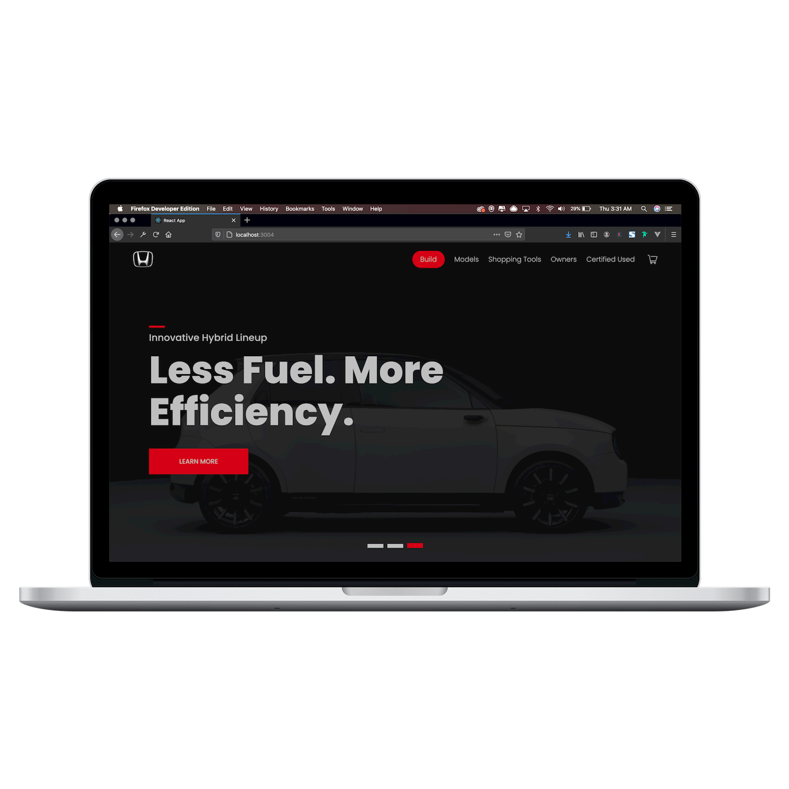
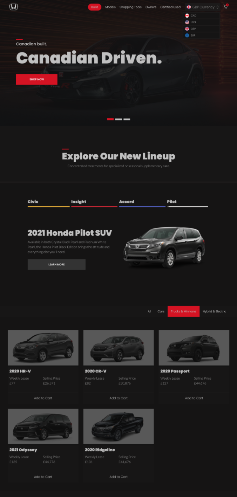

# Honda Canada (Mock site/ design)

**I built this project as a way to get comfortable using Reacts Context API and local storage. It uses the Exchange Rate API and saves the users currency preference in a universal state reducer along with their selected cart items.**

## Live Site

View the live verson [here](https://honda-app.netlify.app/).

## Tech Stack 

Reacts context API and local storage are used throughout the application to maintain the users cart items, cart total and currency preference, making it easy to share data across components without the added expense of using Redux. 

This project uses the Exchange Rate API and updates the universal state depending on the users currency preference.

## Lessons Learned

By combining Context API with a reducer, we were able to create a global store for all the state in our application, without relying on passing props down through the component tree. This makes our application set up for any future expansions and the overall process was a lot easier to implement than I initially expected.

## Accomplishments

I wanted to create this project from scratch, without the use of any added libraries so I spent a good amount of time creating the custom carousels and scroll animations. 

I also found the concept of creating custom hooks a little daunting before the start of this project, so I used this application as a playground to get more comfortable with extracting logic into custom hooks to make component compisition more accessible.

